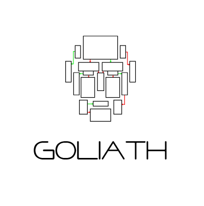
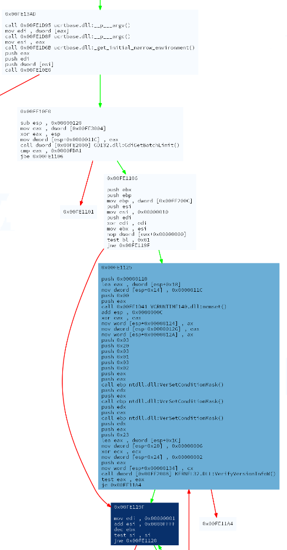

## Malware analysis engine plugin for control flow graph generation

[](https://ci.appveyor.com/project/hoenirvili/cfgtrace)
 [](https://opensource.org/licenses/MIT)
[](https://codecov.io/gh/hoenirvili/CFGTrace)
[](https://www.codefactor.io/repository/github/hoenirvili/goliath)


## Partial flow graph generation iteration 1

```c
#include <Windows.h>
#include <VersionHelpers.h>

DWORD get_version(void)
{
	if (!IsWindows8OrGreater())
		return 0x2312;

	return 0x0;
}

int main()
{
	DWORD limit = GdiGetBatchLimit();
	bool limit_above = false;
	if (limit > 0xfda1)
		limit_above = true;

	DWORD version = 0x0;
	if (limit_above)
		DWORD version = get_version();

	WORD decompile = 0x10;
	if (version > 6)
		if (!limit_above)
			decompile--;

	WORD loop = 0x0;
	for (WORD i = 0; decompile > 0; --decompile) {
		version = 0;
		if (decompile % 2 == 0)
			version = get_version();

		if (version == 0)
			loop = 1;
	}

	const int c = 10;
	int i = 0;
	int aux;

	do {
		aux = i % c;
		i++;
		if (i == 10)
			break;
	} while (aux < 10);

	return aux - loop;
}
```

## Snipped output compiled with /DGRAPHVIZ


